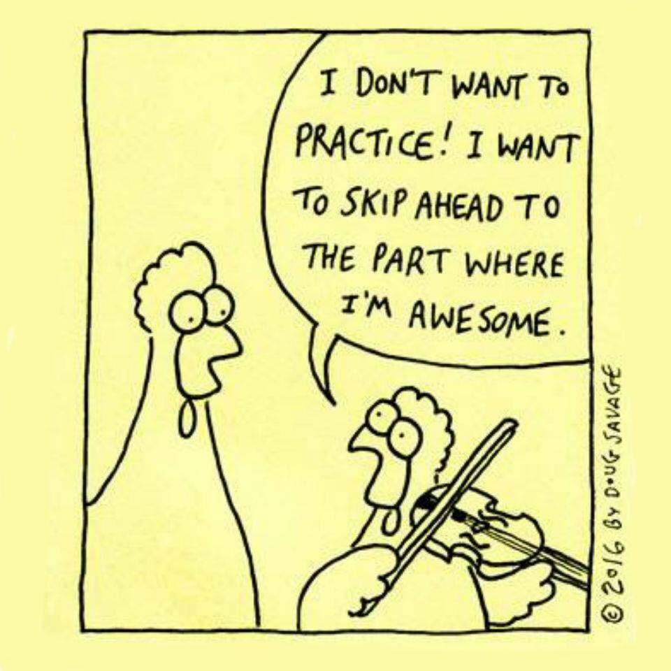

# Julia

* [Julia Express](http://bogumilkaminski.pl/files/julia_express.pdf)

* [Introduction to Computational
  thinking](https://computationalthinking.mit.edu/Fall20/) (Alan
  Edelman, David Sanders, Grant Sanderson et al.)

* [Quantecon cheatsheet](https://cheatsheets.quantecon.org/) (Julia, Matlab, Python)

# Git and github

Spectrum of solutions:

**RCS**: version control from the 1980s...

**Git**: Version control for those with an IQ of over 200.

<https://lab.github.com/>

<https://lgatto.github.io/github-intro/>

<https://github.com>

Get the educational pack via <https://education.github.com>.

# Notebooks and mybinder

Rstudio can be run in the cloud.

e.g. <https://mybinder.org/v2/gh/sje30/neuRo/master?urlpath=rstudio>

See: <https://github.com/sje30/neuRo>

but it also runs [notebooks](https://jupyter.org), 
e.g. [Jupyter with R](https://mybinder.org/v2/gh/binder-examples/r/master?filepath=index.ipynb)

Other solutions exist including [colab](https://colab.research.google.com) and [pluto.jl](https://github.com/fonsp/Pluto.jl).

# Writing your own packages

Wrap up your code and data into an R package so that it can be easily
shared with others (or just for yourself...)

e.g. <https://rstudio.com/resources/rstudioconf-2018/you-can-make-a-package-in-20-minutes-jim-hester/>

<https://evamaerey.github.io/package_in_20_minutes/package_in_20_minutes>

# Tidyverse

Hadley Wickham's important contributions to R...

The "tidyverse" approach

ggplot2 <https://ggplot2.tidyverse.org/>

devtools <https://devtools.r-lib.org/>

Advanced R <https://adv-r.hadley.nz/>

R for data science: <https://r4ds.had.co.nz/index.html>

#  Now practice

{ width=250px }

<https://www.savagechickens.com/2016/04/practice.html>
